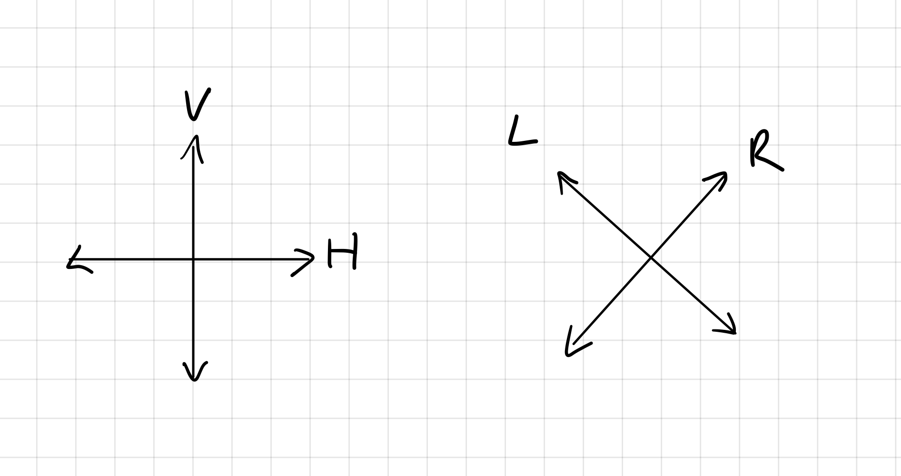

# quantum cryptography

## toc

<!-- vim-markdown-toc GFM -->

* [quantum key distribution](#quantum-key-distribution)
  * [BB84 protocol](#bb84-protocol)
* [links](#links)

<!-- vim-markdown-toc -->

# quantum key distribution

Basic order of events:

1. generating a one time pad between Alice and Bob
2. then checking if anybody was eavesdropping

---

* after sharing the key a test if performed:
  * if anybody was listening the key is discarded
  * if not they have a new key to communicate with
* the reason why this works is because **any measurement on a quantum object leaves a trace**
  * it is impossible to read information traveling over a quantom channel without perturbing it

## BB84 protocol

* this scheme can use any quantum object with a two value observeable
* in practice the quantum object is the **polarization of a photon**

---

Alice has a source to generate photons with four possible polarizations:

1. **H**, horizontal
2. **V**, vertical
3. **L**, left
4. **R**, right

H and R are along the X and Y axis. L and R 45 degrees rotated from that.

</img>

# links

* [Quantum Optics – Quantum cryptography the BB84 QKD scheme (YouTube)](https://www.youtube.com/watch?v=MlsrCzDdAbE)

