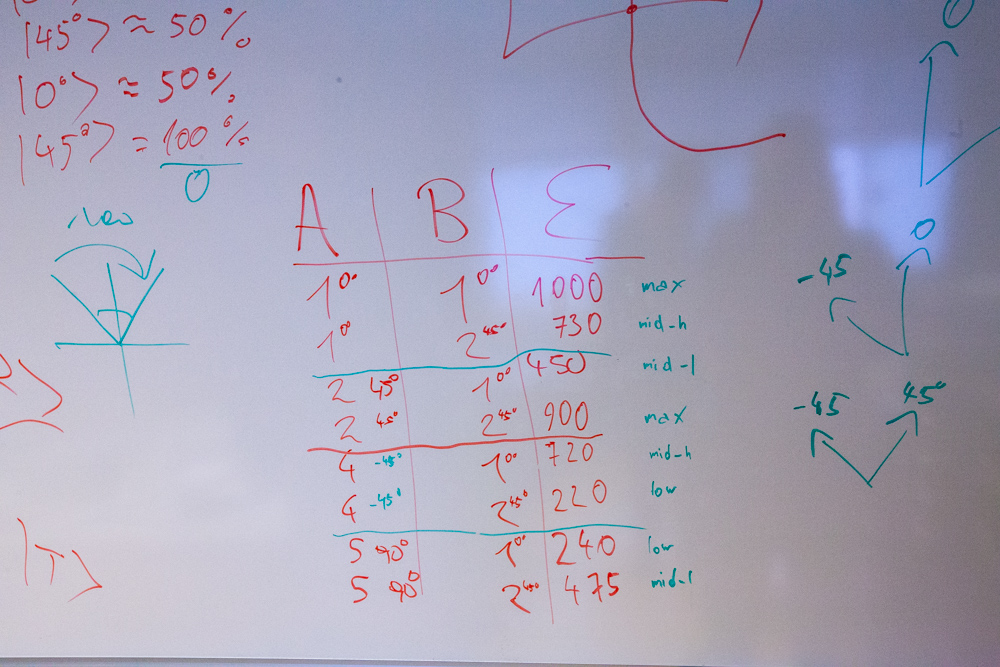

# BB84 Quantum Cryptography Demo

Demonstration of quantum-cryptography-based one-time pad communication via the BB84 algorithm using a non-single photon source.

## table of contents

<!-- vim-markdown-toc GFM -->

* [project progress](#project-progress)
* [contributors](#contributors)
* [current hardware setup](#current-hardware-setup)
* [repo structure](#repo-structure)
* [whiteboard](#whiteboard)

<!-- vim-markdown-toc -->

## project progress

* [Kanban Board](https://github.com/bmedicke/quantum_cryptography/projects/1?fullscreen=true) 📝
* [Milestones](https://github.com/bmedicke/quantum_cryptography/milestones) 🗿

## contributors

| Author           | GitHub profile                                  |
|------------------|-------------------------------------------------|
| Benjamin Medicke | [bmedicke](https://github.com/bmedicke)         |
| Ferdi Cevik      | [Osomo3000](https://github.com/Osomo3000)       |
| Manuel Nagel     | [namanuel](https://github.com/namanuel)         |
| Nikolai Benedikt | [nikobenedikt](https://github.com/nikobenedikt) |

When pair-programming trail the commit message with: 
`Co-authored-by: Name <name@example.com>`.

See [Creating co-authored commits on GitHub](https://docs.github.com/en/github/committing-changes-to-your-project/creating-a-commit-with-multiple-authors#creating-co-authored-commits-on-github) for details.

## current hardware setup

TODO: add photo

## repo structure

* [Theory](theory.md) 💭 describes the theory behind the BB84 algorithm
* [Hardware](hardware.md) 🔭 collects information about the hardware setup (filter orientation, etc.) and used hardware
* [Software](software.md) 🧑🏻‍💻 setup instructions, collection of potentially useful libraries
* [Notebooks](notebooks/readme.md) 🪐 contains the Jupyter Notebooks for Alice, Bob and Eve

## whiteboard

